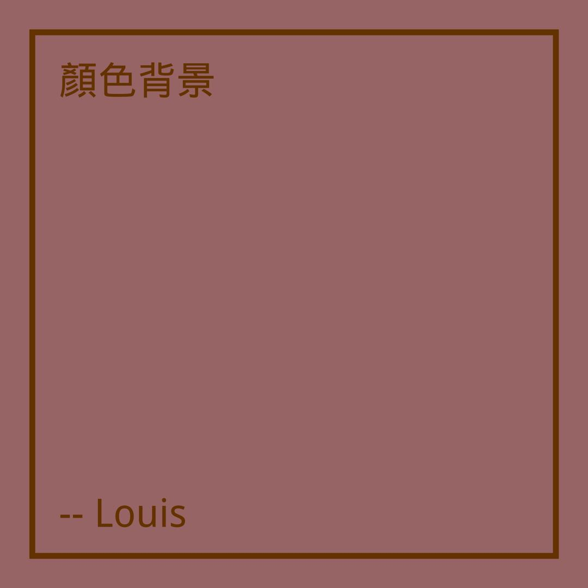
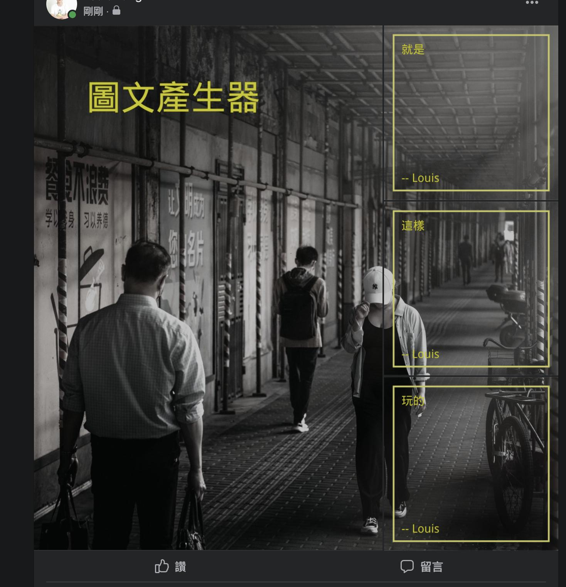

# 粉專/IG圖文加工器

## 介紹
* 給PS智障(ex:我)使用，用於產生圖文
* 腳本省去每次重複步驟
* 可載入圖片(方形，請先處理過，歡迎PR)
* 圖片簡易套用濾鏡
* 可將圖片切片

## 要求
* Python 版本 3.9

## 安裝
* 安裝最新 python
* `pip3 install -r requirement.txt`

## 效果




## 簡易說明
* 不設定邊框(border)顏色就不會有邊框
* 不代入 bgimage 預設純白背景

### FB 預覽說明
FB 會偵測人臉會使得圖片預覽位置偏易，拼圖對不上。<br />
建議用景物圖，或經過高斯模糊處理。

### 檔案
./tool_filter.py 濾鏡
./tool_slice.py 切片
./tool_text.py 上字

### ./tool_text.py mode: 處理對象
0. 一大圖
1. 2:1
2. 3:2
3. 1:2
4. 2:3
5. 四格圖

## 範例
```sh
./square.sh # 顏色方圖
./fb_s1.sh ./sample/photo.jpg # 單一大圖
./fb_w2h1.sh ./sample/photo.jpg # 首圖長寬比 2:1(1大2小 首圖在上)
./fb_w3h2.sh ./sample/photo.jpg # 首圖長寬比 3:2(1大3小 首圖在上)
./fb_w1h2.sh ./sample/photo.jpg # 首圖長寬比 1:2(1大2小 首圖在左)
./fb_w2h3.sh ./sample/photo.jpg # 首圖長寬比 2:3(1大3小 首圖在左)
./fb_s4.sh ./sample/photo.jpg # 四格圖
./ig_s9.sh ./sample/photo.jpg # IG九宮格
```


## LICENSE
MIT